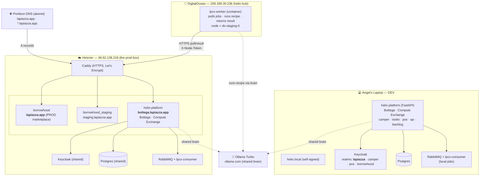
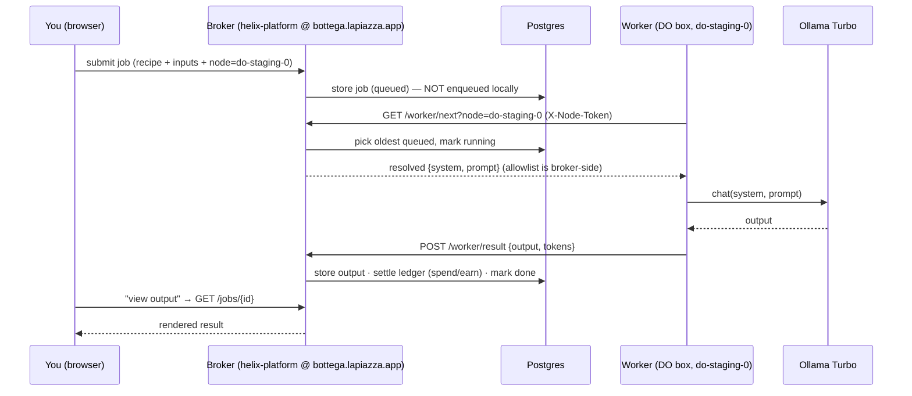
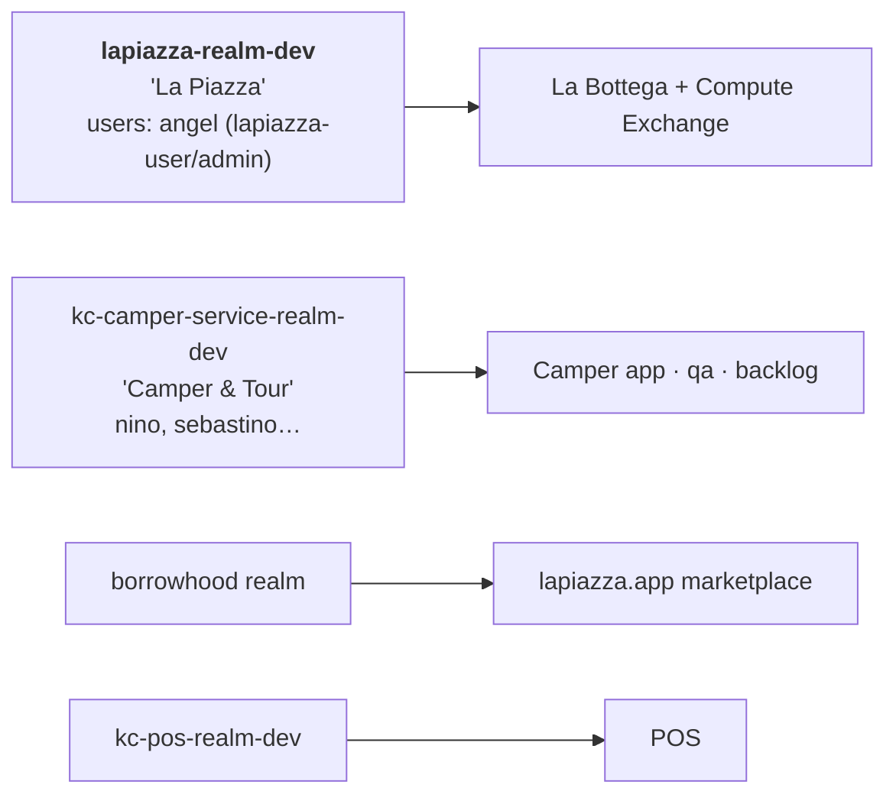

# La Piazza / HelixNet — The Castle Map

*The whole thing on one page: boxes, IPs, what runs where, how work flows.*
*Render: GitHub shows the Mermaid diagrams below automatically. Edit = just text.*

---

## The three machines

---

## How a job flows (the genie loop)

---

## Who guards which door (Keycloak realms)

---

## The cheat-sheet

| Thing | Where | Notes |
|---|---|---|
| **DEV** | laptop, `helix.local` | full stack; login works; no live remote worker |
| **PROD marketplace** | `lapiazza.app` → Hetzner | borrowhood app, real traffic — **do not break** |
| **Bottega / Compute** | `bottega.lapiazza.app` → Hetzner | helix-platform; shares the box with prod |
| **staging (marketplace)** | `staging.lapiazza.app` → Hetzner | borrowhood_staging only |
| **Worker node** | `206.189.30.236` (helix-hub) | `lpcx-worker`, node `do-staging-0`, pulls from bottega |
| **Shared brain** | `ollama.com` (Turbo) | flat-rate; workers relay to it (no local model yet) |
| **The rule** | — | a Bottega deploy is a **prod-box** deploy: gate on dev → pull+restart → verify prod 200 |

*Live flow view (jobs moving through this in real time) = the Grafana dashboard, built next.*
