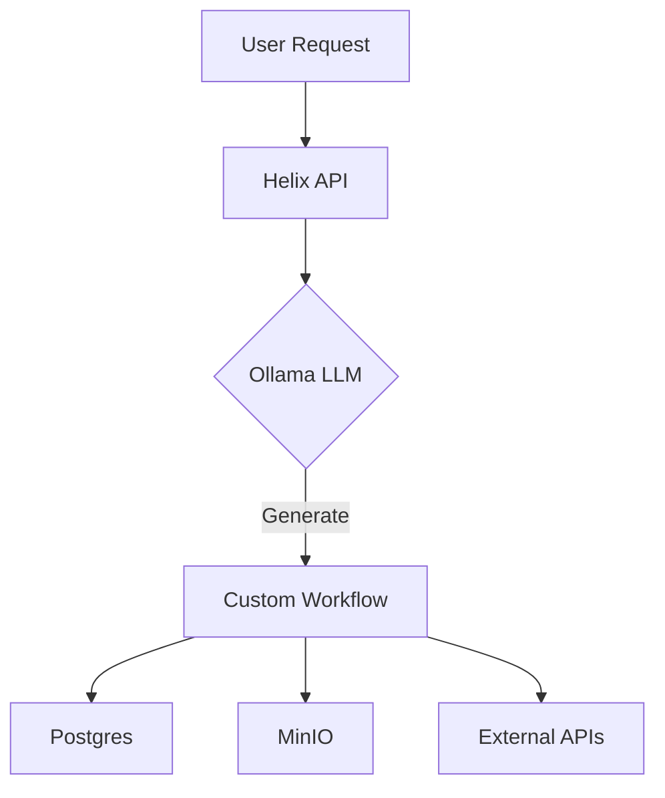

Using a USB-based backup for a demo system is a great way to illustrate backup/restore concepts while making it clear it's for educational/demo purposes only. 
Here's how to implement this effectively:

### Demo System Backup Strategy

**1. Create a Clear Warning System:**
```bash
#!/bin/bash
# backup-demo.sh

echo "=============================================="
echo " WARNING: THIS IS A DEMO-ONLY BACKUP SYSTEM  "
echo "          NOT FOR PRODUCTION USE             "
echo "=============================================="
echo ""

# Continue with backup process...
```

**2. Simplified Backup Script:**
```bash
#!/bin/bash
# demo-backup.sh

# Configuration
DEMO_MODE=true
BACKUP_ROOT="/mnt/usb/velix-demo"
TIMESTAMP=$(date +%Y%m%d_%H%M%S)
BACKUP_DIR="$BACKUP_ROOT/$TIMESTAMP"

# Create backup directory
mkdir -p "$BACKUP_DIR"

# Demo banner
echo "🚀 Starting VELIX Demo Backup"
echo "💾 Backup destination: $BACKUP_DIR"
echo "⚠️  Remember: This is for demonstration purposes only!"

# 1. Backup PostgreSQL
echo "🔍 Capturing database..."
docker exec postgres pg_dumpall -U postgres > "$BACKUP_DIR/db_demo.sql" 2>/dev/null

# 2. Backup important configs
echo "📝 Saving configurations..."
tar czf "$BACKUP_DIR/configs.tgz" /path/to/demo/configs 2>/dev/null

# 3. Create restore script
cat > "$BACKUP_DIR/RESTORE_README.txt" <<EOL
=== VELIX DEMO RESTORE INSTRUCTIONS ===

THIS IS FOR DEMONSTRATION PURPOSES ONLY!
NOT RECOMMENDED FOR PRODUCTION USE!

To restore:
1. Insert this USB drive
2. Run: ./restore-demo.sh $TIMESTAMP

Remember: In production, you would use:
- Automated cloud backups
- Point-in-time recovery
- Tested disaster recovery procedures
EOL

# 4. Create restore script
cat > "$BACKUP_DIR/restore-demo.sh" <<'EOL'
#!/bin/bash
# restore-demo.sh

if [ -z "$1" ]; then
  echo "Usage: $0 <backup_timestamp>"
  exit 1
fi

BACKUP_DIR="/mnt/usb/velix-demo/$1"

echo "=== DEMO RESTORE PROCESS ==="
echo "Restoring from: $BACKUP_DIR"
echo "This is a simulation of disaster recovery."

# Simulate restore process
echo "[SIMULATION] Stopping services..."
sleep 2
echo "[SIMULATION] Restoring database..."
sleep 3
echo "[SIMULATION] Restoring configurations..."
sleep 2
echo "[SIMULATION] Verification in progress..."
sleep 2

echo -e "\n✅ Demo restore completed!"
echo "In a real production environment, you would:"
echo "1. Use cloud-based backups"
echo "2. Have automated verification"
echo "3. Follow strict change management"
EOL

chmod +x "$BACKUP_DIR/restore-demo.sh"

# Completion message
echo -e "\n✅ Backup complete!"
echo "Backup location: $BACKUP_DIR"
echo -e "\nℹ️  This demo shows basic backup concepts."
echo "   For production, consider:"
echo "   - DigitalOcean Spaces"
echo "   - Automated cloud backups"
echo "   - Regular recovery testing"
```

**3. Demo Disaster Scenario Script:**
```bash
#!/bin/bash
# disaster-demo.sh

echo "💥 SIMULATED DISASTER SCENARIO 💥"
echo "---------------------------------"
echo "Oh no! The VELIX system has experienced:"
echo "❌ Database corruption"
echo "❌ Configuration loss"
echo "❌ Service outage"
echo ""
echo "Time to demonstrate recovery!"

# Simulate damage
echo -e "\n🔧 Simulating system damage..."
docker stop postgres redis
docker rm postgres redis
echo "✅ Damage simulated!"

# Show recovery instructions
echo -e "\n🔧 INSERT YOUR BACKUP USB DRIVE NOW"
read -p "Press Enter when USB is connected..."

# Show restore process
echo -e "\n🔧 Beginning recovery process..."
if [ -d "/mnt/usb/velix-demo" ]; then
  echo "Backup found! Please run:"
  echo "cd /mnt/usb/velix-demo"
  echo "ls -lt # to see available backups"
  echo "./latest/restore-demo.sh"
else
  echo "❌ No backup found! This is why we need:"
  echo "   - Automated backups"
  echo "   - Offsite storage"
  echo "   - Regular testing"
fi
```

**4. Demo Flow:**

1. **Pre-Demo Setup:**
   ```bash
   # Make scripts executable
   chmod +x backup-demo.sh disaster-demo.sh
   
   # Create USB mount point
   sudo mkdir -p /mnt/usb
   ```

2. **During Demo:**
   ```bash
   # Show normal operation
   ./backup-demo.sh
   
   # Simulate disaster
   ./disaster-demo.sh
   
   # Demonstrate "recovery" from USB
   cd /mnt/usb/velix-demo/latest
   ./restore-demo.sh
   ```

**5. Visual Cues for Demo:**
```bash
# Add to your .bashrc for demo terminals
export PS1="\e[41mDEMO MODE\e[0m \u@\h:\w\$ "
```

**6. Post-Demo Discussion Points:**
- Why USB isn't sufficient for production:
  - Manual intervention required
  - Single point of failure
  - No version history
  - Physical security risks
- What enterprises should use instead:
  ```mermaid
  graph LR
    A[Production Backup] --> B[Automated Cloud Backups]
    A --> C[Multi-Region Storage]
    A --> D[Point-in-Time Recovery]
    A --> E[Regular DR Testing]
  ```

**7. Handout for Attendees:**
```
=== VELIX Backup Concepts Demo ===

What we demonstrated:
- Basic backup/restore concepts
- Disaster scenario simulation
- Manual recovery process

What you need for production:
✅ Automated, scheduled backups
✅ Offsite, encrypted storage
✅ Regular recovery testing
✅ Monitoring and alerting
✅ Documented procedures

Example Production Tools:
- Cloud: AWS S3, DigitalOcean Spaces
- Tools: Restic, BorgBackup, Velero
- Monitoring: Prometheus alerts, Healthchecks.io
```

This approach gives you a compelling demo that shows the mechanics while clearly communicating this isn't production-grade. 
It sets up the conversation for your actual backup solution.  

Here are several "show-stopper" issues and enhancement opportunities for VELIX, along with strategic use cases that could drive architectural decisions:

### Critical Show-Stoppers That Need Fixing

**1. Resource Contention Issues**
```yaml
# docker-compose.override.yml
services:
  ollama:
    deploy:
      resources:
        limits:
          cpus: '4'
          memory: 16G
    devices:
      - driver: nvidia
        count: 1
        capabilities: [gpu]
```

**Problem:** LLM inference (Ollama) competing with other services for CPU/RAM  
**Solution:** Implement resource constraints and GPU passthrough

**2. Single Point of Failure (PostgreSQL)**
```yaml
# Example of what's missing
postgres:
  image: bitnami/postgresql:15
  environment:
    - POSTGRESQL_REPLICATION_MODE=master
    - POSTGRESQL_REPLICAS=2
```

**Problem:** Production systems can't rely on single DB instance  
**Solution:** Add replication and failover

**3. Security Hardening**
```bash
# Missing security practices
- No network segmentation
- Default credentials in use
- No TLS termination at service level
```

**Solution:** 
```yaml
networks:
  frontend:
    driver: bridge
    internal: false
  backend:
    driver: bridge
    internal: true

services:
  traefik:
    networks:
      - frontend
  postgres:
    networks:
      - backend
```

### Strategic Use Cases for VELIX

**1. AI-Powered Business Automation**


**Required Mods:**
- Add workflow engine (Airflow/Prefect)
- Enhance API gateway with rate limiting
- Add message queue for async processing

**2. Enterprise Chatbot Platform**
```yaml
# Needed additions
services:
  qdrant:
    image: qdrant/qdrant
    ports:
      - "6333:6333"
    volumes:
      - qdrant_data:/data

  doc-processor:
    build: ./doc-processor
    environment:
      - QDRANT_URL=qdrant:6333
```

**Required Mods:**
- Vector database for RAG
- Document processing pipeline
- Multi-tenant support in Keycloak

**3. ML Ops Platform**
```bash
# Example enhancement
velix ml deploy --model llm2 --gpu 1 --replicas 3
```

**Required Mods:**
- Model versioning
- A/B testing framework
- Monitoring for model drift

### Resource Optimization Opportunities

**1. Dynamic Scaling**
```yaml
# docker-compose.scale.yml
services:
  worker:
    deploy:
      replicas: 3
      resources:
        reservations:
          cpus: '0.5'
          memory: 1G
        limits:
          cpus: '2'
          memory: 4G
```

**2. Cost-Effective GPU Utilization**
```python
# gpu-scheduler.py
def schedule_gpu_jobs():
    if not high_priority_queue.empty():
        assign_gpu(high_priority_queue.pop())
    elif time.hour in range(9, 17):  # Business hours
        assign_gpu(batch_jobs.pop())
```

**3. Storage Optimization**
```yaml
services:
  minio:
    command: server /data --console-address ":9001"
    environment:
      - MINIO_COMPRESS=true
      - MINIO_COMPRESS_EXTENSIONS=".pdf,.docx,.txt"
      - MINIO_COMPRESS_MIME_TYPES="text/*,application/json"
```

### Must-Have Production Additions

**1. Observability Stack**
```yaml
services:
  loki:
    image: grafana/loki:latest
    ports:
      - "3100:3100"

  tempo:
    image: grafana/tempo:latest
    ports:
      - "3200:3200"
      - "4317:4317"  # OTLP gRPC
```

**2. Security Enhancements**
```bash
# Add to all containers
securityContext:
  readOnlyRootFilesystem: true
  runAsNonRoot: true
  capabilities:
    drop:
      - ALL
```

**3. Backup and DR**
```yaml
services:
  velero:
    image: velero/velero:v1.11
    command: server
    volumes:
      - ./velero-config:/credentials
    environment:
      - AWS_ACCESS_KEY_ID=${AWS_ACCESS_KEY}
      - AWS_SECRET_ACCESS_KEY=${AWS_SECRET_KEY}
```

### Demo-Worthy Scenarios

**1. "Chaos Engineering" Demo**
```bash
# chaos.sh
echo "Simulating network partition..."
docker network disconnect velix-network postgres

sleep 30  # Show failure state

echo "Demonstrating failover..."
# Show read replicas taking over
```

**2. Auto-Scaling Demo**
```python
# load_test.py
import requests
import threading

def generate_load():
    while True:
        requests.post("http://helix/predict", json={"input": "test"})

# Start 100 threads
for _ in range(100):
    threading.Thread(target=generate_load).start()
```

**3. Security Breach Simulation**
```bash
# Show detection of:
- Brute force attempts blocked by Keycloak
- Suspicious activity in Vault logs
- Automatic container quarantine
```

### Strategic Decisions Needed

1. **Monolith vs Microservices:**
   - Current state: Hybrid
   - Recommendation: Move to full microservices with service mesh

2. **Data Layer:**
   - Add caching layer (Redis)
   - Implement database sharding
   - Add message queue for async processing

3. **AI/ML Specific:**
   - Model versioning
   - Feature store
   - Experiment tracking
